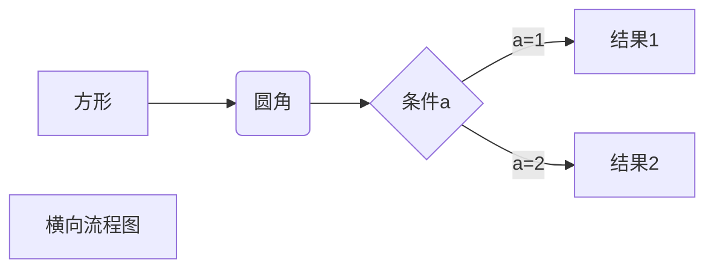
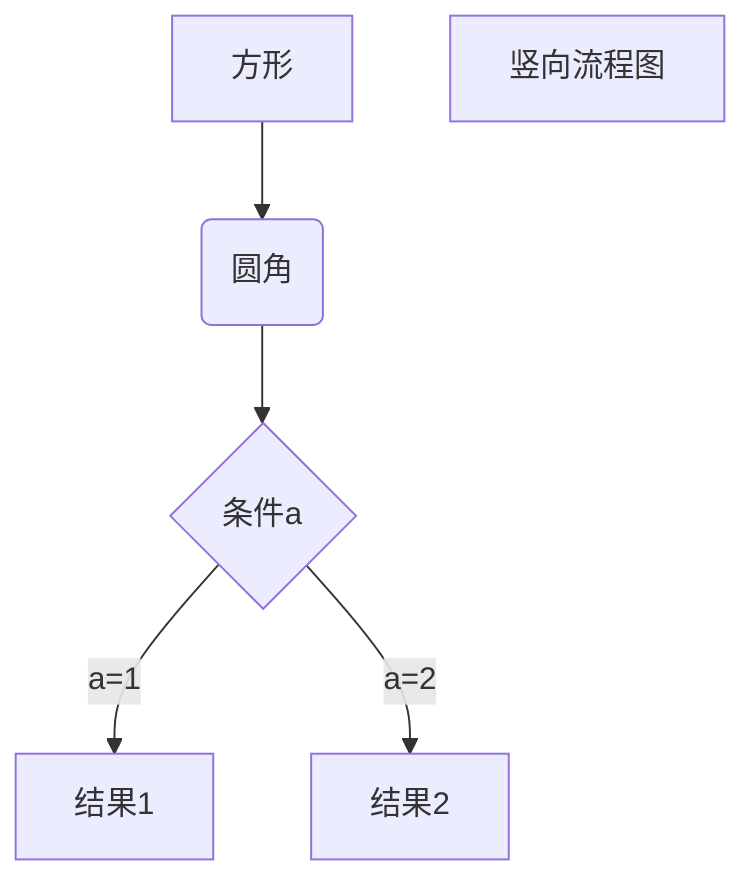
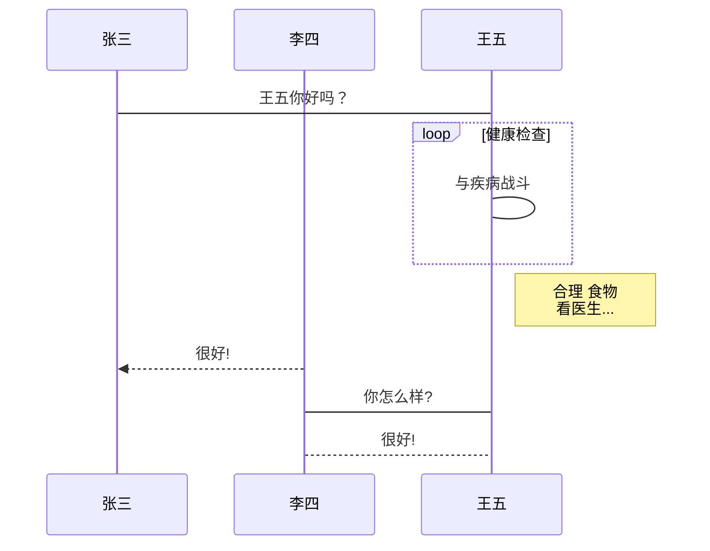
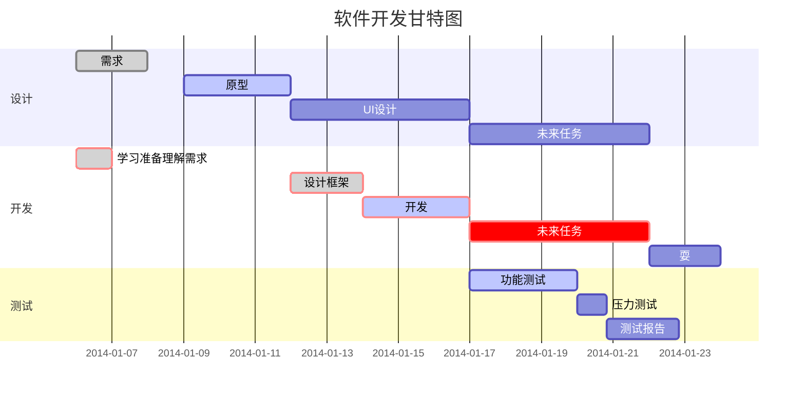

# Markdown 编辑器语法指南

Markdown 是一种轻量级标记语言，  可以快速的撰写帮助文档或是用于论坛上发表消息。

## 基本技巧

### 代码

如果你只想高亮语句中的某个函数名或关键字，可以使用 ``function_name()`` 实现

通常编辑器根据代码片段适配合适的高亮方法，但你也可以用 `````` 包裹一段代码，并指定一种语言

```markdown
{```}javascript
$(document).ready(function () {
    alert('hello world');
});
{```}
--注意去除括号{}
```

`支持的语言：1c, abnf, accesslog, actionscript, ada, apache, applescript, arduino, armasm, asciidoc, aspectj, autohotkey, autoit, avrasm, awk, axapta, bash, basic, bnf, brainfuck, cal, capnproto, ceylon, clean, clojure, clojure-repl, cmake, coffeescript, coq, cos, cpp, crmsh, crystal, cs, csp, css, d, dart, delphi, diff, django, dns, dockerfile, dos, dsconfig, dts, dust, ebnf, elixir, elm, erb, erlang, erlang-repl, excel, fix, flix, fortran, fsharp, gams, gauss, gcode, gherkin, glsl, go, golo, gradle, groovy, haml, handlebars, haskell, haxe, hsp, htmlbars, http, hy, inform7, ini, irpf90, java, javascript, json, julia, kotlin, lasso, ldif, leaf, less, lisp, livecodeserver, livescript, llvm, lsl, lua, makefile, markdown, mathematica, matlab, maxima, mel, mercury, mipsasm, mizar, mojolicious, monkey, moonscript, n1ql, nginx, nimrod, nix, nsis, objectivec, ocaml, openscad, oxygene, parser3, perl, pf, php, pony, powershell, processing, profile, prolog, protobuf, puppet, purebasic, python, q, qml, r, rib, roboconf, rsl, ruby, ruleslanguage, rust, scala, scheme, scilab, scss, smali, smalltalk, sml, sqf, sql, stan, stata, step21, stylus, subunit, swift, taggerscript, tap, tcl, tex, thrift, tp, twig, typescript, vala, vbnet, vbscript, vbscript-html, verilog, vhdl, vim, x86asm, xl, xml, xquery, yaml, zephir`

也可以使用 4 空格缩进，再贴上代码，实现相同的的效果

```markdown
    def g(x):
        yield from range(x, 0, -1)
    yield from range(x)
```

如你不需要代码高亮，可以用下面的方法禁用：

```markdown
{```}nohighlight
{```}
--注意去除括号{}
```

### 标题

文章内容较多时，可以用标题分段：

```markdown
标题1
======

标题2
-----

## 大标题 ##
### 小标题 ###
```

### 粗斜体

```markdown
*斜体文本*    _斜体文本_
**粗体文本**    __粗体文本__
***粗斜体文本***    ___粗斜体文本___
```

### 链接

常用链接方法

```markdown
文字链接 [链接名称](http://链接网址)
网址链接 <http://链接网址>
```

高级链接技巧

```markdown
这个链接用 1 作为网址变量 [Google][1].
这个链接用 yahoo 作为网址变量 [Yahoo!][yahoo].
然后在文档的结尾为变量赋值（网址）

  [1]: http://www.google.com/
  [yahoo]: http://www.yahoo.com/
```

### 列表

普通无序列表

```markdown
- 列表文本前使用 [减号+空格]
+ 列表文本前使用 [加号+空格]
* 列表文本前使用 [星号+空格]
```

普通有序列表

```markdown
1. 列表前使用 [数字+空格]
2. 我们会自动帮你添加数字
3. 不用担心数字不对，显示的时候我们会自动把这行的 7 纠正为 3
```

列表嵌套

~~~markdown
1. 列出所有元素：
    - 无序列表元素 A
        1. 元素 A 的有序子列表
    - 前面加四个空格
2. 列表里的多段换行：
    前面必须加四个空格，
    这样换行，整体的格式不会乱
3. 列表里引用：

    > 前面空一行
    > 仍然需要在 >  前面加四个空格

4. 列表里代码段：

    ```
    前面四个空格，之后按代码语法 ``` 书写
    ```

        或者直接空八个，引入代码块
~~~

### 引用

普通引用

```markdown
> 引用文本前使用 [大于号+空格]
> 折行可以不加，新起一行都要加上哦
```

引用里嵌套引用

```markdown
> 最外层引用
> > 多一个 > 嵌套一层引用
> > > 可以嵌套很多层
```

引用里嵌套列表

```markdown
> - 这是引用里嵌套的一个列表
> - 还可以有子列表
>     * 子列表需要从 - 之后延后四个空格开始
```

引用里嵌套代码块

```markdown
>     同样的，在前面加四个空格形成代码块
>
> {```}
> 或者使用 {```} 形成代码块
> {```}
--注意去除括号{}
```

### 图片

跟链接的方法区别在于前面加了个感叹号 `!`，这样是不是觉得好记多了呢？

```markdown

```

当然，你也可以像网址那样对图片网址使用变量

```markdown
这个链接用 1 作为网址变量 [Google][1].
然后在文档的结尾位变量赋值（网址）

 [1]: http://www.google.com/logo.png
```

 Markdown 还没有办法指定图片的高度与宽度，如果你需要的话，你可以使用普通的 `` 标签。

```html
 < img src="http://logo.png" style="width:300px;height:100 px"/>
 < img src="http://logo.png" style="float:right; zoom:33%"/>
 < img src="http://logo.png" alt="logo" align="left" style="zoom:33%"/>
```

### 换行

如果另起一行，只需在当前行结尾加 2 个空格

```markdown
在当前行的结尾加 2 个空格
这行就会新起一行
```

如果是要起一个新段落，只需要空出一行即可。

### 分隔符

如果你有写分割线的习惯，可以新起一行输入三个减号`-`。当前后都有段落时，请空出一行：

```markdown
前面的段落

---

后面的段落
```

### 表格

Markdown 制作表格使用 **|** 来分隔不同的单元格，使用 **-** 来分隔表头和其他行。

语法格式如下：

```markdown
| 表头  | 表头  |
| ----- | ----- |
| 单元格 | 单元格 |
| 单元格 | 单元格 |
```

## 对齐方式

我们可以设置表格的对齐方式：

- **-:** 设置内容和标题栏居右对齐。
- **:-** 设置内容和标题栏居左对齐。
- **:-:** 设置内容和标题栏居中对齐。

实例如下：

```markdown
| 左对齐 | 右对齐 | 居中对齐 |
| :-----| ----: | :----: |
| 单元格 | 单元格 | 单元格 |
| 单元格 | 单元格 | 单元格 |
```

## 高级技巧

### 行内 HTML 元素

目前只支持部分段内 HTML 元素效果，包括 `` ，如

键位显示

```markdown
使用 <kbd>Ctrl</kbd>+<kbd>Alt</kbd>+<kbd>Del</kbd> 重启电脑
```

代码块

```markdown
使用 <pre></pre> 元素同样可以形成代码块
```

粗斜体

```markdown
<b> Markdown 在此处同样适用，如 *加粗* </b>
```

### 符号转义

如果你的描述中需要用到 markdown 的符号，比如 `_` `#` `*` 等，但又不想它被转义，这时候可以在这些符号前加反斜杠，如 `\_` `\#` `\*` 进行避免。

```markdown
\_不想这里的文本变斜体\_
\*\*不想这里的文本被加粗\*\*
```

Markdown 支持以下这些符号前面加上反斜杠来帮助插入普通的符号：

```markdown
\   反斜线
`   反引号
*   星号
_   下划线
{}  花括号
[]  方括号
()  小括号
#   井字号
+   加号
-   减号
.   英文句点
!   感叹号
```

### 扩展

支持 **jsfiddle、gist、runjs、优酷视频**，直接填写 url，在其之后会自动添加预览点击会展开相关内容。

```markdown
http://{url_of_the_fiddle}/embedded/[{tabs}/[{style}]]
https://gist.github.com/{gist_id}
http://runjs.cn/detail/{id}
http://v.youku.com/v_show/id_{video_id}.html
```

### 公式

当你需要在编辑器中插入数学公式时，可以使用两个美元符 $$ 包裹 TeX 或 LaTeX 格式的数学公式来实现。提交后，问答和文章页会根据需要加载 Mathjax 对数学公式进行渲染。如：

```markdown
$$
\mathbf{V}_1 \times \mathbf{V}_2 =  \begin{vmatrix}
\mathbf{i} & \mathbf{j} & \mathbf{k} \\
\frac{\partial X}{\partial u} &  \frac{\partial Y}{\partial u} & 0 \\
\frac{\partial X}{\partial v} &  \frac{\partial Y}{\partial v} & 0 \\
\end{vmatrix}
$$tep1}{\style{visibility:hidden}{(x+1)(x+1)}}
$$
```

同时也支持 HTML 属性，如：

```markdown
$$ (x+1)^2 = \class{hidden}{(x+1)(x+1)} $$

$$
(x+1)^2 = \cssId{step1}{\style{visibility:hidden}{(x+1)(x+1)}}
$$
```

## typora 画流程图、时序图(顺序图)、甘特图

**1、横向流程图源码格式：**

~~~markdown

~~~

**2、竖向流程图源码格式：**

~~~markdown

~~~

**3、标准流程图源码格式：**

~~~markdown
```flow
st=>start: 开始框
op=>operation: 处理框
cond=>condition: 判断框(是或否?)
sub1=>subroutine: 子流程
io=>inputoutput: 输入输出框
e=>end: 结束框
st->op->cond
cond(yes)->io->e
cond(no)->sub1(right)->op
```
~~~

**4、标准流程图源码格式（横向）：**

~~~markdown
```flow
st=>start: 开始框
op=>operation: 处理框
cond=>condition: 判断框(是或否?)
sub1=>subroutine: 子流程
io=>inputoutput: 输入输出框
e=>end: 结束框
st(right)->op(right)->cond
cond(yes)->io(bottom)->e
cond(no)->sub1(right)->op
```
~~~

**5、UML时序图源码样例：**

~~~markdown
```sequence
对象A->对象B: 对象B你好吗?（请求）
Note right of 对象B: 对象B的描述
Note left of 对象A: 对象A的描述(提示)
对象B-->对象A: 我很好(响应)
对象A->对象B: 你真的好吗？
```
~~~

**6、UML时序图源码复杂样例：**

~~~markdown
```sequence
Title: 标题：复杂使用
对象A->对象B: 对象B你好吗?（请求）
Note right of 对象B: 对象B的描述
Note left of 对象A: 对象A的描述(提示)
对象B-->对象A: 我很好(响应)
对象B->小三: 你好吗
小三-->>对象A: 对象B找我了
对象A->对象B: 你真的好吗？
Note over 小三,对象B: 我们是朋友
participant C
Note right of C: 没人陪我玩
```
~~~

**7、UML标准时序图样例：**

~~~markdown

~~~

**8、甘特图样例：**

~~~markdown

~~~


流程图来源[➡链接](https://www.runoob.com/note/47651)

------
